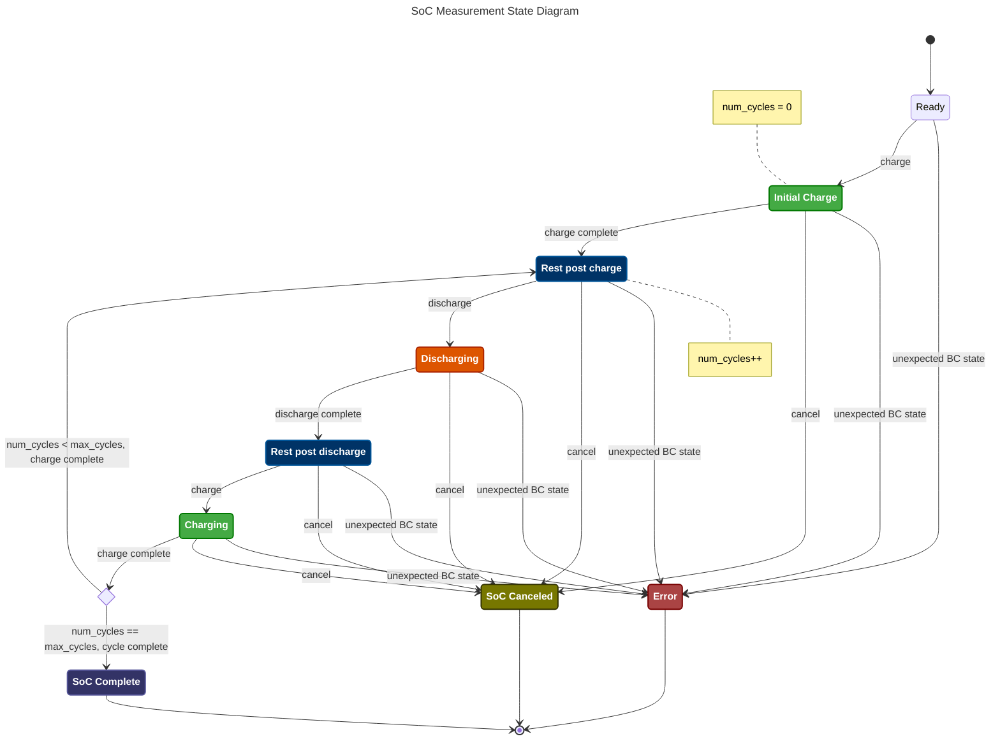

SoC Measure State Machine
=========================

Below is a [state diagram] that governs the [FSM] for measuring SoC for a given
Battery Controller.

See the [code] and [api-docs] for more details.

This state diagram was also converted to a [DrawIO] diagram and saved a [PNG].

<!-- Links -->
[state diagram]: https://mermaid.js.org/syntax/stateDiagram.html
[FSM]: https://en.wikipedia.org/wiki/Finite-state_machine
[code]: ./Firmware/src/lib/statemachines.py
[api-docs]: doc/firmware-api/src.lib.bat_controller.StateMachine.html
[DrawIO]: https://app.diagrams.net/
[PNG]: doc/design/SoC_StateMachine.drawio.png
[vim-modeline]: # ( vim: set nofoldenable: )
